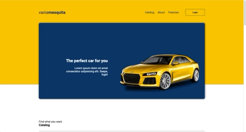

# Projeto Site Carros
Projeto desenvolvido acompanhando o video no YouTube do canal DevSuperior em 2022.

### 
 [Sobre](#sobre) | [Layout](#layout) | [Tecnologias Utilizadas](#tecnologias-utilizadas) 

  

## Sobre 

Esse é um projeto simples, que foi desenvolvido acompanhando o video do canal no YouTube.

No projeto foi desenvolvido apenas uma pagina, que é de um catálogo de carros. Mesmo sendo um projeto simples, foi importante para praticar o uso do **Flexbox**, **Grid** e a **responsividade da página com media queries**

#### Acesse o site completo: <a href="https://site-carro.netlify.app" target="_blank">https://site-carro.netlify.app</a> 

---

## Layout

Você pode acessar o projeto clicando <a href="https://site-carro.netlify.app" target="_blank">aqui</a>

#### 
Web

<table align="center">
   <tr>
    <td valign="top"> </td>
    
   </tr>
 </table>
  

#### 
Mobile
 

<table align="center">
   <tr>
    <td valign="top"> </td>
  </tr>
 </table>
  
 
 ---

## Tecnologias utilizadas

- **HTML5**
- **CSS3**
